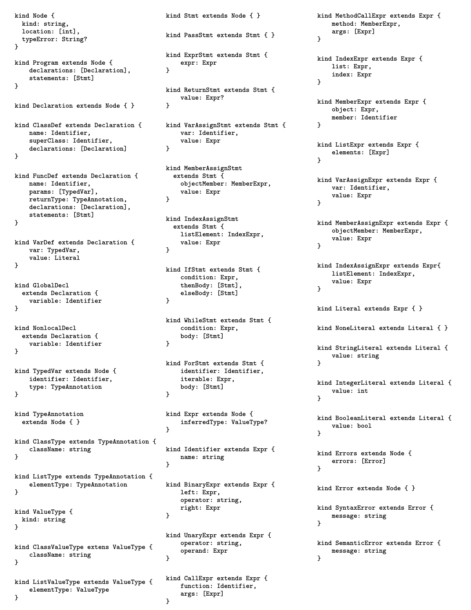

# Programing Assignment II 文档

<!-- TOC -->

- [Programing Assignment II 文档](#programing-assignment-ii-文档)
  - [0. 基础知识](#0-基础知识)
    - [0.1 Declaration 检查](#01-declaration-检查)
      - [0.1.1 全局变量检查](#011-全局变量检查)
      - [0.1.2 for/while变量检查](#012-forwhile变量检查)
      - [0.1.3 函数内变量检查](#013-函数内变量检查)
      - [0.1.4 Class变量检查](#014-class变量检查)
      - [0.1.5 List变量检查](#015-list变量检查)
  - [0.2 Type Checker 检查](#02-type-checker-检查)
    - [0.2.1 类型语义](#021-类型语义)
    - [0.2.2 类型推导](#022-类型推导)
  - [0.3 错误检测](#03-错误检测)
    - [0.3.1 语义检测](#031-语义检测)
    - [0.3.3 类型检测](#033-类型检测)
  - [1. 实验要求](#1-实验要求)
    - [1.0.1 主要工作](#101-主要工作)
    - [1.0.2 提示](#102-提示)
      - [1.0.2.1 注意两者的区别](#1021-注意两者的区别)
    - [1.1 目录结构](#11-目录结构)
    - [1.2 Bonus](#12-bonus)
    - [1.2 编译、运行和验证](#12-编译运行和验证)

<!-- /TOC -->

本次实验是组队实验，请仔细阅读组队要求，并合理进行分工合作。本实验中需要使用`Visitor Pattern`完成对程序的 Declaration Analysis 和 Type Checker Analysis。 Declaration的结果以 Symbol table 的形式传给Type
Checker继续检查。从而使 `Chocopy` 的LSP没有语义错误。

注意：组队实验意味着合作，但是小组间的交流是受限的，且严格**禁止**代码的共享。除此之外，如果小组和其它组进行了交流，必须在根目录 `README.md` 中记录下来交流的小组和你们之间交流内容。同时，需要在此文件中更新两位同学的邮箱和代码WriteUp，WriteUp要求详见[Code Review.pdf]()。
## 0. 基础知识

### 0.1 Declaration 检查

`DeclarationAnalyzer` 检查是一个申明作用域环境的检查，在python中的变量有四个作用域

| 作用域                 | 英文解释                  | 英文简写 |
| ---------------------- | ------------------------- | -------- |
| 局部作用域（函数内）   | Local(function)           | L        |
| 外部嵌套函数作用域     | Enclosing function locals | E        |
| 函数定义所在模块作用域 | Global(module)            | G        |
| python内置模块的作用域 | Builtin                   | B        |

在访问变量时，先查找本地变量，然后是包裹此函数外部的函数内的变量，之后是全局变量 最后是內建作用域内的变量 即： L –> E -> G -> B

```python
Class Real(object):
  value:int=0
  def __init__(self:"Object",val:int)->object:
    self.value=val
  def __add__(self:"Object", other:"Object")->Real:
    return Real(self.value + other.value)
x:int = 0
y:int = 1

def P()->int:
  x:bool = True
  a:bool = False
  def Q()->Real:
    x:Real=None
    x=Real(1)
    y:Real=None
    y=Real(1)
    return x+y
  return Q().value
```


#### 0.1.1 全局变量检查

函数内定义的变量，在函数内部可以访问，但是不能访问函数外部的变量。global 关键字可以用来声明一个全局变量。

```python
x:int = 0
def f():
    x = 1 # 需要在内部声明 global x 才能获得外部变量。
    print(x)
```
#### 0.1.2 for/while变量检查
对于for/while循环，在循环体内部定义的变量，在循环体内部可以访问，但是不能访问循环体外部的变量。in 关键字可以用来声明一个循环变量。in 前的循环变量可以与符号表的变量重名，在循环内是c++ rewrite的语义。

```python
def baz(self:"bar", xx: [int]) -> str:
    global count
    x:int = 0
    y:int = 1
    def qux(y: int) -> object:
        nonlocal x
        if x > y:
            x = -1
    for x in xx: # 此处的 x 在循环内部对外部变量无效
        self.p = x == 2
    qux(0) # Yay! ChocoPy
    count = count + 1
    while x <= 0:
        if self.p:
            xx[0] = xx[1]
            self.p = not self.p
            x = x + 1
        elif foo("Long"[0]) == 1:
            self.p = self is None
    return "Nope"
```

#### 0.1.3 函数内变量检查

Python 支持嵌套定义函数，每次进入函数时需要进入函数本地变量的 scope，同时对外部的 E/G/B 所在定义 aware，不能重名，如有调用需要指向外部的 symbol。

```python
x:int = 0
def crunch(zz:[[int]]) -> object:
    z:[int] = None
    global x
    def make_z() -> object: 
        # 需要添加 nonlocal z 若没有此行需要报错
        for z in zz: # 嵌套函数 z为左值未定义，zz为调用右值，直接访问
            pass # Set z to last element in zz
    make_z()
    for x in z:
        pass # Set x to last element in z
crunch([[1,2],[2,3],[4,5],[6,7]])
print(x) # 嵌套内部的变量修改在外部能看到 类似 c++ [&] lambda Semantic
```

#### 0.1.4 Class变量检查

需要先定义Class，后声明，再定义变量。

```python
class animal(object):
  makes_noise:bool = False
  def make_noise(self: "animal") -> objet:
    if (self.makes_noise):
      print (self. sound ())
  def sound(self: "animal") -> str:
    return "???"
class cow(animal):
  def __init__(self: "cow"):
    self.makes_noise = True
  def sound(self: "cow") -> str:
    return "moo"

c:animal = None
c = cow()
c.make_noise() # Prints "moo"
```

Predefined classes 有 object, int, bool, str, list. 都有 __init__ 方法，以及attribute。自定义 class 可以自定义__init__方法，继承会先放入被继承 class 的 attribute 和 methods，再放入自己的。

```python
class A(object):
    a:int = 42
    def foo(self:"A", ignore:object) -> int:
        return self.a
    def bar(self:"A") -> int:
        print("A")
        return 0
class B(A):
    b:bool = True
    def __init__(self:"B"):
        print("B")
    def bar(self:"B") -> int:
        print("B")
        return 0
class C(B):
    c:bool = True
    def __init__(self:"C"):
        print("C")
    def foo1(self:"C") -> int:
        print("B")
        return 0
    def bar(self:"C") -> int:
        print("C")
        return 0
def t():
    def f():
        return 0
    return 0
d:str=input()
a:A=None
if d=="sb":
    a=C()
else:
    a=A()

print(a.bar())
```

声明时可以声明 father class，动态决定实际 class。这时就需要动态 typeclass 来得到 methods。

#### 0.1.5 List变量检查

List 实现是一个 class，所以定义的时候和 class 实例化一样。初始化会调用 `conslist()`，在 riscv 汇编中是放在 __len__ 后面的一个 attribute，是一个 list/bool/int/str/object/classes 的数组。

```bash
.globl $.list$prototype
$.list$prototype:
  .word -1                                 # Type tag for class: .list
  .word 4                                  # Object size
  .word 0                                  # Pointer to dispatch table
  .word 0                                  # Initial value of attribute: __len__
  .align 2
```

声明如下：

```python
x:[[bool]] = None
y:str = "Hello"
z:[int] = None
i:int = 0

x:[[bool]] = [ [True, False], [False, True] ]
z = [1, 2, 3]

for i in z:
  print(i)

while i<len(z):
  print(z[i][1])
  print(y[i])
  i = i + 1
```

List 和 str 都有 `len()` method 获得长度，都可以用 index access 获取元素，for 语句相当于 `while i<len(*)`.

## 0.2 Type Checker 检查

此项实现在 `TypeChecker` 类中。
### 0.2.1 类型语义

每个类型都有 type tag，预定义如下。

```cpp
enum type { LIST=-1, OBJECT, INT, BOOL, STRING, CLASS };

constexpr bool is_list_type() const { return tid_ == type::LIST; }
constexpr bool is_void_type() const { return tid_ == type::VOID; /** reserved type */ }
constexpr bool is_integer_type() const { return tid_ == type::INT; }
constexpr bool is_bool_type() const { return tid_ == type::BOOL; /** same as int 1 */ }
constexpr bool is_string_type() const { return tid_ == type::STRING; }
constexpr bool is_value_type() const { return is_bool_type() || is_string_type() || is_integer_type(); }
constexpr bool is_class_type() const { return tid_ >= type::CLASS; }
```

int/bool/str 不能被 inherit，所有定义的 class 都是继承 object。同时有两个辅助类型 `<None>`, `<Empty>`。type tag 会在刚进入 `TypeChecker` 时算出来，因为此时 `DeclarationAnalyzer` 把 SymbolTable 已经求出来了。

```cpp
/** set up default class hierarchy
 * <None> <= object
 * <Empty> <= object
 * <None> <= <None>
 * <Empty> <= <Empty>
 */
map<string, string> super_classes = {{"int", "object"},   {"bool", "int"},      {"none", "object"},
                                     {"empty", "object"}, {"<None>", "object"}, {"<Empty>", "object"}};
```

以下是基本的类型传播：

1. $T_{1} \leq T_{2}$ (i.e., ordinary subtyping)
2. $T_{1}$ is <None $>$ and $T_{2}$ is not int, bool, or str.
3. $T_{2}$ is a list type $[T]$ and $T_{1}$ is <Empty>.
4. $T_{2}$ is a the list type $[\mathrm{T}]$ and $T_{1}$ is $[\langle$ None $\rangle]$, where $\langle$ None $\rangle \leq a T$

最后两项的定义是为了防止 x:[A]= [None, None]，x:[ [A ] ]=[ [None ] ] 这两种情况，同时 List 若内部的 type 不一样是无法传播的。

对于其他 op 的类型传播可以用 Least Common Ancestor 来刻画。

1. 如果$A\leq_{a} B$，那么$A\sqcup B=B\sqcup A=B$
2. 否则，$A\sqcup B$只是$A$和$B$在由$\leq$定义的树状类型层次中的最小共同祖先。

### 0.2.2 类型推导
此部分详见[ChocoPy Language Reference](../chocopy_language_reference.pdf)的 Section 5. 首先需要定义现在所在的 Type Environment，由一个四元组定义 $$
## 0.3 错误检测
所有官方需要报的错误在[pa2](../../tests/pa2/sample)下以**bad**打头。
1. [bad_duplicate_global.py](../../tests/pa2/sample/bad_duplicate_global.py) 

语义分析阶段会检测两种类型的错误：语义错误和类型检查错误。语义错误是对上述所列语义规则的违反。类型检查错误是对ChocoPy语言参考手册中所列类型规则的违反。如果输入的程序包含语义错误，那么语义分析阶段的输出预计将是一个语义错误信息的列表，以及它们的来源位置。只有在没有语义错误的情况下才会报告类型检查错误。如所述，类型检查错误与类型化的AST一起被在线报告。
### 0.3.1 语义检测

### 0.3.3 类型检测
本检查主要是为了


## 1. 实验要求

本实验的输出可以实现对语义检查的要求，建立在语法没有错误的基础上，同样可以输出高亮在IDE中。

本次实验需要各位同学根据`ChocoPy`的语义补全[chocopy_semant.cpp](./src/semantic/chocopy_semant.cpp)
文件，完成完整的语法分析器，能够输出识别出语义错误的位置。

### 1.0.1 主要工作

1. 了解 `visitor` 模式基础知识和理解 ChocoPy 语义（重在了解如何在 `visitor` 模式下）
2. 阅读 `./src/semantic/chocopy_ast.cpp`以及 `./src/semantic/chocopy_semant.cpp`（重在理解分析树的使用）
3. 了解 `./src/semantic/chocopy_semant.cpp` 中的语义检查，并完成语义检查
4. 补全 `./src/semantic/chocopy_semant.cpp` 文件，以及如果你需要其他改写的代码可以自行改写。

### 1.0.2 提示

文本输入：

```c
a: int = 1
```

则对应语义检查结果应为：

```json
{
  "kind" : "Program",
  "location" : [ 1, 1, 1, 11 ],
  "declarations" : [ {
    "kind" : "VarDef",
    "location" : [ 1, 1, 1, 10 ],
    "var" : {
      "kind" : "TypedVar",
      "location" : [ 1, 1, 1, 6 ],
      "identifier" : {
        "kind" : "Identifier",
        "location" : [ 1, 1, 1, 1 ],
        "name" : "a"
      },
      "type" : {
        "kind" : "ClassType",
        "location" : [ 1, 4, 1, 6 ],
        "className" : "int"
      }
    },
    "value" : {
      "kind" : "IntegerLiteral",
      "location" : [ 1, 10, 1, 10 ],
      "value" : 1
    }
  } ],
  "statements" : [ ],
  "errors" : {
    "errors" : [ ],
    "kind" : "Errors",
    "location" : [ 0, 0, 0, 0 ]
  }
}
```

对语义的抽象语法树输出文件如下，注意Type Error与Declaration Error输出位置的区别。

```json
{
  "kind" : "Program",
  "location" : [ 1, 1, 1, 11 ],
  "declarations" : [ {
    "kind" : "VarDef",
    "location" : [ 1, 1, 1, 10 ],
    "var" : {
      "kind" : "TypedVar",
      "location" : [ 1, 1, 1, 6 ],
      "identifier" : {
        "kind" : "Identifier",
        "location" : [ 1, 1, 1, 1 ],
        "name" : "a"
      },
      "type" : {
        "kind" : "ClassType",
        "location" : [ 1, 4, 1, 6 ],
        "className" : "int"
      }
    },
    "value" : {
      "kind" : "IntegerLiteral",
      "location" : [ 1, 10, 1, 10 ],
      "inferredType" : {
        "kind" : "ClassValueType",
        "className" : "int"
      },
      "value" : 1
    }
  } ],
  "statements" : [ ],
  "errors" : {
    "errors" : [ ],
    "kind" : "Errors",
    "location" : [ 0, 0, 0, 0 ]
  }
}
```

#### 1.0.2.1 注意两者的区别

1. 添加了新的对象类型**ValueType**、**ClassValueType**、**ListValueType**。这些将被用来存储类型检查后推断出的程序表达式的类型信息。注意，这些类型几乎与**TypeAnnotation**和它的两个子类型完全相似。
    
    **TypeAnnotation**和**ValueType**之间的区别在于，后者没有扩展Node；因此，ValueType对象没有位置属性。这应该是有道理的，因为在语义分析期间分配的类型实际上并不存在于源代码中。
2. 类型Expr有一个新的属性：inferredType，它可以是null。在分析器产生的AST中，这个属性对每个表达式都是空的。语义分析为每个可以求值的程序表达式推断类型。具体来说，推断类型（inferredType）属性只对以下情况保持空。
   1. 直接出现在**FuncDef**、**ClassDef**、**TypedVar**、**GlobalDecl**、**NonlocalDecl**、**VarAssignExpr**、**VarAssignStmt**、**MemberExpr**、**ForStmt**或**CallExpr**属性中的标识符对象
   2. 紧接着**MethodCallExpr**、**MemberAssignExpr**或**MemberAssignStmt**中包含的**MemberExpr**
   3. 紧接着 **IndexAssignExpr**或 **IndexAssignStmt**中包含的 **IndexExpr**。注意，空值属性在JSON表示中被简单省略是可以接受的。
3. 如果有语法错误，对应的errors为`CompilerError`且`syntax=true`。对语法接收的errors体现为`Error`，检测程序不会检查错误信息与个数，所以不需要考虑错误的贪心信息，可以找到一个不可接收的程序直接报错返回。
   1. Node种类有一个新的属性：**typeError**。在解析器产生的AST中，这个属性对每个节点都是空的。如果在对一个节点进行类型检查时出现了错误，那么该节点的**typeError**将为非空。对于一个类型良好的ChocoPy程序来说，在语义分析阶段的输出中，每个节点的**typeError**属性都将为空。注意，空值属性在JSON表示中被简单省略是可以接受的。
   2. 除了**SyntaxError**之外，还增加了一个新的**SemanticError**种类。如果输入的AST对应于含有语义错误的ChocoPy程序，那么语义分析阶段的输出应当是一个**Errors**类型的JSON对象，其中将包含一个或多个**SemanticError**类型的节点。请注意，**SemanticError**（语义错误）对象确实继承了一个 locations（位置）属性。该属性将包含与分析导致错误的AST节点相对应的源代码位置。

**具体的需识别的语法推导错误参考[所有错误](#03-错误检测)，需要实现的抽象语法树参考[chocopy_ast.hpp](../../include/parser/chocopy_ast.hpp)**

**特别说明：对于部分token，我们只需要进行过滤，即只需被识别，但是不应该被输出到分析结果中。因为这些token对程序运行不起到任何作用。**

> 注意，你所需修改的文件应仅有[chocopy_semant.cpp](../../src/semantic/chocopy_semant.cpp)和[chocopy_parse.cpp](../../src/parser/chocopy_parse.cpp)，后者用于修改输出，如果发现其他bug，请开分支只commit你认为的bug并提交PR。关于`visitor pattern`用法已经在[visitor.md](./visitor.md)中进行简短的介绍，更高阶的用法请参考谷歌和StackOverflow。

### 1.1 目录结构

详见[common/structure.md](./doc/common/structure.md)


### 1.2 Bonus

在正确作出所有给出语法推导的情况下报出所有给出案例的错误[10pts]

### 1.2 编译、运行和验证

* 编译

  若编译成功，则将在 `./[build_dir]/` 下生成 `semantic` 命令。

* 运行

  本次实验的 `semantic` 命令使用 shell 的输入重定向功能，即程序本身使用标准输入输出（stdin 和 stdout），但在 shell 运行命令时可以使用 `<` `>` 和 `>>` 灵活地自定义输出和输入从哪里来。

  ```shell
  $ cd chocopy
  $ ./build/semantic               # 交互式使用（不进行输入重定向）
  <在这里输入 ChocoPy代码，如果遇到了错误，将程序将报错并退出。>
  <输入完成后按 ^D 结束输入，此时程序将输出解析json。>
  $ ./build/semantic < test.py # 重定向标准输入
  <此时程序从 test.py 文件中读取输入，因此不需要输入任何内容。>
  <如果遇到了错误，将程序将报错并输出错误json；否则，将输出解析json。>
  $ ./build/semantic test.py  # 不使用重定向，直接从 test.py 中读入
  $ ./build/semantic < test.py > out
  <此时程序从 test.py 文件中读取输入，因此不需要输入任何内容。>
  ```

  通过灵活使用重定向，可以比较方便地完成各种各样的需求，请同学们务必掌握这个 shell 功能。

* 验证

  本次试验测试案例较多，为此我们将这些测试分为两类：

    1. sample: 这部分测试均比较简单且单纯，适合开发时调试。
    2. fuzz: 由fuzzer生成的正确的python文件，此项不予开源。
    3. student: 这部分由同学提供。

  我们使用python中的 `json.load()` 命令进行验证。将自己的生成结果和助教提供的 `xxx.typed.ast` 进行比较。

  ```shell
  $ python3 ./duipai.py --pa 2
  # 如果结果完全正确，则全 PASS，且有分数提示，一个正确的case 1 pts，此项评分按比例算入总评。选择chocopy的同学会在project部分分数上*1.2计入总评。
  # 如果有不一致，则会汇报具体哪个文件哪部分不一致，且有详细输出。
  ```

  **请注意助教提供的`testcase`并不能涵盖全部的测试情况，完成此部分仅能拿到基础分，请自行设计自己的`testcase`进行测试。**
